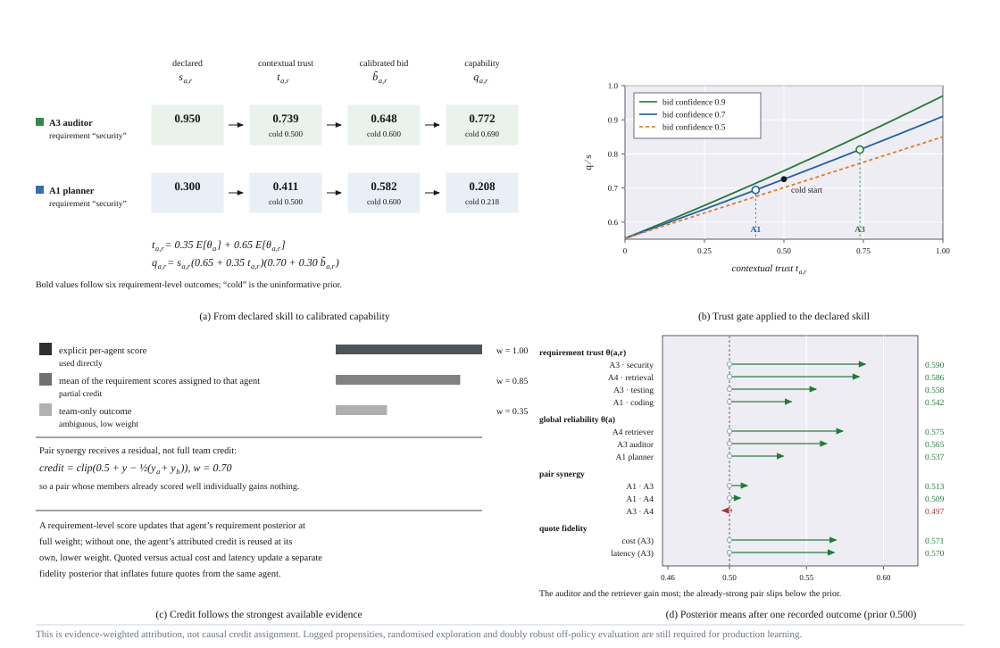
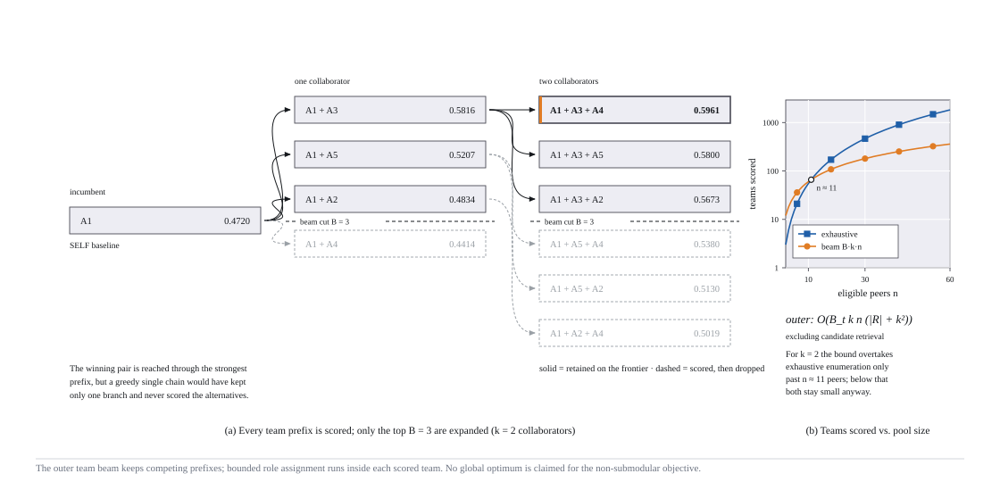

# SAGE checkpoint-aware algorithm design

## 1. Decision problem

An incumbent agent is executing task \(x\). At each routing event, SAGE chooses a mode \(m\), executor team \(S\), requirement-to-agent assignment \(z\), and communication topology \(E\):

- \(m=\mathrm{SELF}\): the incumbent continues alone;
- \(m=\mathrm{COLLABORATE}\): the incumbent retains ownership and recruits peers;
- \(m=\mathrm{HANDOFF}\): one peer receives full ownership.

The decision can be made before execution or after progress, artifacts, failures, and active executors are known. A2A supplies discovery and task transport; SAGE is the policy layer that chooses a feasible execution configuration.

## 2. Task and live state

A task supplies:

- a weighted requirement DAG \(G_x=(R,D)\), including minimum capability thresholds;
- value, budget, deadline, permissions, and risk tolerance;
- coordination, handoff, and replanning friction;
- an estimate of how much incumbent context can be transferred.

`ExecutionState` supplies the active route and ownership map, completed requirements, the current in-flight requirement, its completed fraction and observed partial quality, per-artifact transferability, failed agents, and consecutive failure count. Completed DAG nodes are removed from the next routing decision while preserving dependency effects.

The scalar `progress` field remains as a coarse compatibility signal. Checkpoint-aware routing uses the more specific `inflight_requirement`, `inflight_progress`, `inflight_quality`, `active_assignments`, and `artifact_transferability` fields. A progress-masked ablation retains the same completed nodes and resource limits but sets the in-flight fraction to zero.

## 3. Permission-first feasibility

An agent is removed before ranking when it is unavailable, failed, or unauthorized. Cost and latency quotes are inflated by learned bid-fidelity posteriors and current load.

After the hard filter, a deterministic quote-only prefilter retains the incumbent, active executors, and the highest-relevance peers up to `candidate_limit` (12 by default). This (O(n|R|)) pass bounds the expensive combinatorial search without using the learned route objective. Request-scoped caches memoize calibrated skill, risk-adjusted cost, and latency values. Candidate retrieval in a production registry should happen before this local prefilter.

After a team has been formed, SAGE performs a second feasibility check using workload-sensitive team cost and DAG critical-path latency. A high learned score can never override permissions or availability. If no plan satisfies budget and deadline, the default API returns the least-violating authorized plan with `feasible=False` and explicit `constraint_violations`. Set `allow_degraded=False` for strict exception behavior. Degraded routing never relaxes permissions, failure state, or availability.

`route_with_trace` retains hard-filter reasons, prefiltered agent IDs, feasible alternatives, and degraded candidates. This creates an audit record without allowing an unauthorized or unavailable agent back into the candidate set.

## 4. Contextual capability calibration

SAGE maintains both a global reliability posterior \(\theta_a\) and a requirement-conditioned posterior \(\theta_{a,r}\). For advertised capability \(s_{a,r}\) and bid confidence \(b_a\):

$$
t_{a,r}=0.35\,\mathbb E[\theta_a]+0.65\,\mathbb E[\theta_{a,r}]
$$

$$
\widetilde b_{a,r}=t_{a,r}b_a+(1-t_{a,r})0.5
$$

$$
q_{a,r}=s_{a,r}(0.65+0.35t_{a,r})(0.70+0.30\widetilde b_{a,r})
$$

This prevents success in one domain from fully transferring to unrelated domains. Cold-start agents remain selectable. With exploration enabled, one coherent Thompson sample is drawn per belief and reused across every candidate compared in the same routing event.

<b>Contextual calibration and learning.</b> Declared skill and bid confidence are gated by global and requirement-conditioned evidence; updates follow the strongest available credit signal.

## 5. Checkpoint-adjusted ownership, assignment, and topology

Let current owner \(a_0\) have completed fraction \(f_r\) of the in-flight requirement, and let \(\tau_r\) be that artifact's portability. Candidate owner \(a\) reuses:

$$
\eta_{a,r}=\begin{cases}
f_r,& a=a_0\text{ and }a_0\text{ has not failed},\\
f_r\tau_r,&\text{otherwise}.
\end{cases}
$$

Its checkpoint-adjusted capability and remaining work are:

$$
\bar q_{a,r}=\eta_{a,r}q_r^{\mathrm{current}}+(1-\eta_{a,r})q_{a,r},
\qquad d_{a,r}=1-\eta_{a,r}.
$$

When a partial artifact has an observed evaluator score, it supplies \(q_r^{\mathrm{current}}\); otherwise the calibrated current-owner estimate is used. Only the assigned owner contributes requirement coverage. The previous noisy-OR over every selected teammate was removed because it credited agents that were not assigned work.

Role assignment is optimized jointly with the schedule instead of assigning every requirement to its strongest calibrated agent in isolation. A bounded assignment beam expands owners in topological requirement order and retains prefixes using assigned capability, bottleneck satisfaction, contextual trust, posterior uncertainty, communication edges, and current critical-path latency. The original strongest-agent assignment is always retained as a fallback candidate. Complete assignments are compared with the same learned success model and constrained utility as route candidates, and the highest-utility deadline-feasible assignment represents the team.

This matters when the strongest agent for several independent requirements would serialize all of them: assigning one requirement to a slightly weaker peer can reduce critical-path latency enough to satisfy the deadline. The weighted assigned-owner mean and lowest threshold ratio remain separate features, so one missing critical capability cannot be hidden by a high mean.

Requirement dependencies induce communication edges whenever two dependent nodes are assigned to different agents. Any remaining disconnected executor component is linked to the route coordinator through a component root, so the reported topology covers the entire selected team and coordination overhead is not understated. Independent requirements on different agents can run concurrently; requirements assigned to the same agent are serialized. The resulting resource-constrained DAG schedule estimates critical-path latency before the route is accepted. The topology is an inspectable schedule output, not a claimed communication-graph optimizer.

If \(w_a=\sum_{r:z_r=a}\omega_r d_{a,r}/\sum_r\omega_r\) is checkpoint-adjusted remaining work and \(\rho_a\) is the activation fraction, predicted team cost is:

$$
C(S,z)=\sum_{a\in S}\widehat c_a\left[\rho_a+(1-\rho)w_a\right].
$$

The default \(\rho\) is 0.15; already-active agents pay one quarter of that setup fraction. Requirement duration is multiplied by the same \(d_{a,r}\), so lost work affects cost and latency once. Production adapters can replace this model with token-, tool-, or milestone-level quotes.

Pairwise Beta posteriors model explicitly evaluated collaboration evidence, while skill-vector similarity measures possible redundancy. Team-level success alone does not update pair beliefs. These are implementation features rather than claims that the complete utility is submodular.

## 6. Learned success model

The original hand-written success equation has been replaced by an online logistic model:

$$
\widehat p(y=1\mid x,m,S,z,E)=\sigma\left(w_0+w^\top\phi(x,m,S,z,E)\right)
$$

Features currently include assigned-owner coverage, bottleneck satisfaction, contextual trust, pair synergy, redundancy, coordination loss, and executor load. Route diagnostics also expose switching loss, but the default model does not separately weight lost work after checkpoint-adjusted cost and latency have already accounted for it. The model starts from configurable priors and applies regularized stochastic-gradient updates after outcomes. `OnlineSuccessModel.randomized()` and `.zeroed()` expose weak-prior ablations so evaluation can separate the hand-written prior from learning.

This lightweight model is intentionally replaceable. Production deployments can substitute a GBDT, encoder model, Bayesian neural network, or offline contextual-bandit reward model while retaining the same constraint and search layers.

## 7. Progress-aware constrained utility

Each feasible route is ranked by:

$$
U=V\widehat p-\lambda_c\bar C-\lambda_l\bar L-\lambda_rR
  -\lambda_hH-\lambda_oO-\lambda_u\mathcal U+\beta\mathcal B
$$

where:

- \(\bar C\) and \(\bar L\) are budget- and deadline-normalized cost and latency;
- \(R\) is contextual empirical risk;
- \(H\) is fixed route-reconfiguration friction for detailed checkpoint states;
- \(O\) is DAG communication overhead;
- \(\mathcal U\) is posterior uncertainty;
- \(\mathcal B\) is an optional exploration bonus.

For detailed checkpoint states, partial-work loss is represented by \(d_{a,r}\) in projected capability, cost, and duration rather than by another scalar penalty. \(H\) retains only fixed reconfiguration friction, discounted after repeated failures. The older coarse-state path remains available for integrations that only provide overall progress and transferable context.

## 8. Joint bounded team and role search

SAGE evaluates SELF and every feasible single-agent HANDOFF directly. For every candidate team, it first searches requirement ownership with an assignment beam of width `assignment_beam_width`:

1. traverse remaining requirements in topological order;
2. expand every retained prefix with each possible executor;
3. rank prefixes by assigned capability, bottleneck satisfaction, trust, uncertainty, partial critical-path latency, and induced communication edges;
4. retain the best bounded set plus the original strongest-agent assignment;
5. fully schedule complete assignments and choose the highest-utility feasible assignment when one exists.

COLLABORATE teams are then constructed using the outer bounded beam search:

1. start with the incumbent;
2. expand each frontier team with every eligible peer;
3. evaluate workload-sensitive cost after assigning requirements;
4. evaluate assignment, DAG schedule, probability, and utility;
5. retain the best `beam_width` partial teams;
6. continue until the collaborator limit is reached.

The nested search preserves multiple competing team and ownership prefixes instead of committing to one greedy team or one greedy role map. It is still a bounded approximation: partial-assignment ranking is heuristic, and SAGE does not claim a global optimum for the non-submodular, resource-constrained full objective.

For \(n\) registry agents, prefilter limit \(p\), team beam width \(B_t\), assignment beam width \(B_a\), collaborator limit \(k\), and \(|R|\) requirements, candidate scoring costs \(O(n|R|)\). The bounded search after prefiltering is approximately \(O(B_tkpB_a k|R|^2)\). The extra \(|R|\) factor comes from rescoring bounded assignment prefixes for clarity in the dependency-free implementation. Without prefiltering, substitute \(n\) for \(p\), which explains the prior near-linear latency growth with registry size.

`benchmark_scaling.py` measures this boundary. On one Apple Silicon development machine, the default top-12 configuration routed the six-requirement case in a median 78.4 ms at 20 agents, 78.9 ms at 40, and 80.1 ms at 80 (three repeats; environment-specific, not a latency SLA). Candidate retrieval, network calls, and executor latency are excluded.

<b>Bounded team search.</b> The figure isolates the outer team beam; the current router runs the bounded role-assignment search described above inside each scored team.

## 9. Evidence-aware online updates

`ExecutionOutcome` can contain overall quality, per-agent scores, per-requirement scores, explicit pair scores, actual cost, and actual latency.

Updates follow the strongest available evidence:

1. explicit agent scores update agent reliability;
2. otherwise, scores of requirements assigned to an agent provide partial credit;
3. if only a team outcome exists, it is treated as low-weight ambiguous evidence;
4. requirement scores update contextual capability posteriors;
5. pair synergy updates only from explicit `pair_scores`; an overall team score is not treated as evidence of a pair effect;
6. quote-versus-actual deviations update cost and latency fidelity;
7. the selected route updates the online success predictor.

This avoids the previous unsupported `0.5 + overall - individual_mean` residual heuristic, but it is not yet causal credit assignment. Logged propensities, randomized exploration, and doubly robust off-policy evaluation are still needed for production learning.

The reference implementation can export these learned beliefs and model parameters as a versioned JSON snapshot. Restore requires an exact agent roster, which prevents evidence from silently attaching to a different marketplace population. Snapshot persistence does not make concurrent updates transactional and does not preserve the exploration random-generator state.

## 10. Three separated synthetic studies

### 10.1 Checkpoint trajectory replay

`benchmark_dynamic.py` generates execution events with completed DAG prefixes, an in-flight requirement, observed partial quality, artifact-specific portability, sunk resources, and occasional incumbent failure. `benchmark_dynamic_evaluator.py` does not call router scoring helpers and never maps scalar progress into a handoff penalty. It computes how much concrete work is reused or redone, then evaluates final geometric/bottleneck quality, multiplicative compatibility, added workload cost, recovery latency, wasted work, and deadline misses.

The common action space includes progress-aware SAGE, an otherwise identical progress-masked SAGE, always-continue, always-handoff, static greedy team formation, bounded static coalition enumeration, and a hidden-state dynamic oracle. The default five-seed study replays 1,000 trajectories. It also performs a controlled intervention on near-substitutable research agents, holding task, registry, difficulty, portability, budget, and deadline fixed while changing only in-flight completion from 0.0 to 0.9.

### 10.2 Requirement-conditioned trust convergence

`benchmark_trust.py` compares the 0.35 global/0.65 requirement-conditioned trust representation with one global reputation score. Both receive the same exogenous round-robin observations, so exploration cost and policy feedback cannot explain their difference. A heterogeneous specialist scenario measures calibration and routing regret; a homogeneous negative control checks that contextual accounting does not manufacture a routing advantage when specialization is absent.

### 10.3 Independent-task regression and learning ablations

`benchmark.py` retains the structurally held-out 2,500-task regression suite. It compares solo, random-team, greedy-team, static SAGE, learned-no-exploration, learned-exploration, and weak-random-prior policies. Static versus learned-no-exploration isolates updates; learned-no-exploration versus learned-exploration isolates exploration; informed versus random initialization exposes prior sensitivity; first/last windows expose learning movement.

All environments remain authored by the repository maintainers. They are useful for reproducibility, regression, and counterexamples, not evidence of external validity. Publishable evidence requires repeated checkpointed real executions, heterogeneous A2A endpoints, an independently governed artifact evaluator, safety tests, and confidence intervals. Every runner accepts explicit seeds and emits JSON so reported tables can be regenerated exactly.

## 11. Relationship to prior work

SAGE draws on coalition formation, multi-agent task allocation, combinatorial allocation, contextual bandits, LLM routing, and dynamic agent-network research. It uses heuristic bounded search rather than claiming global optimality or auction truthfulness, and its current online updates do not satisfy causal bandit-evaluation requirements. See [RELATED_WORK.md](RELATED_WORK.md) for a source-linked comparison table and explicit scope differences.

## 12. Integration and operational boundary

`sprix_a2a.py` separates Agent Card declarations from local numeric evidence. A card skill becomes routable only when the caller supplies a calibrated score for the declared skill ID, plus cost, latency, permissions, availability, and load. The adapter then converts a selected route into a transport-neutral execution plan.

The adapter does not verify identity or signatures, authenticate endpoints, transmit messages, manage credentials, evaluate artifacts, or enforce execution isolation. Those controls remain the responsibility of the registry, A2A client, executor, and policy layer described in [docs/INTEGRATION.md](docs/INTEGRATION.md) and [docs/OPERATIONS.md](docs/OPERATIONS.md).
