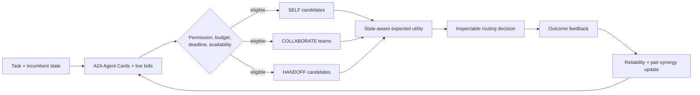

<div align="center">

# Sprix SAGE Router

### State-aware agent matching for open A2A networks

[](https://github.com/wang2122/sprix-sage-router/actions/workflows/tests.yml)
[](https://www.python.org/)
[](LICENSE)
[](#project-status)

**An open-source research output of [Sprix AI](#about-sprix-ai) at 屿智同行.**

Choose whether an agent should **continue alone**, **recruit complementary collaborators**, or **hand off the task**—while accounting for progress, permissions, trust, cost, latency, and coordination risk.

[Quick start](#quick-start) · [Algorithm](ALGORITHM.md) · [Benchmark](#benchmark) · [Contributing](CONTRIBUTING.md) · [Security](SECURITY.md)

</div>

---

## Why SAGE?

Agent discovery tells a system which agents exist. It does not answer the harder runtime question: **who should work with whom after execution has already begun?**

SAGE—**State-Aware Graph Exchange**—is the decision layer between A2A discovery and task execution. It evaluates three routes in one auditable objective:

| Route | Ownership | Best used when |
|---|---|---|
| **SELF** | Incumbent agent | Existing capability and accumulated context are sufficient |
| **COLLABORATE** | Incumbent retains ownership | A small complementary team covers missing requirements |
| **HANDOFF** | A peer takes full ownership | Specialist advantage exceeds context-transfer loss |

SAGE is designed to sit above the [Agent2Agent (A2A) protocol](https://a2a-protocol.org/latest/). A2A provides Agent Cards, messages, tasks, artifacts, authentication, and transport. SAGE decides **which feasible agent configuration should execute the task, in which mode, and why**.



## What makes SAGE different?

- **Mid-execution tri-mode routing.** SELF, COLLABORATE, and HANDOFF compete in the same utility function instead of relying on disconnected heuristics.
- **Progress-aware delegation.** Handoff becomes more expensive as the incumbent accumulates useful context; collaboration can preserve that work.
- **Complementarity before prestige.** A team is rewarded for marginal requirement coverage, not for collecting individually high-ranked but redundant agents.
- **Trust-calibrated bids.** Quoted confidence is discounted using observed reliability, limiting the effect of unsupported self-claims.
- **Permission-first matching.** Ineligible agents never enter the ranking, regardless of predicted quality.
- **Online relationship learning.** Beta posteriors update both individual reliability and pairwise collaboration synergy after completed tasks.
- **Auditable output.** Every decision includes expected success, coverage, cost, latency, risk, utility, and a human-readable rationale.

## Core algorithm

For task requirement \(r\), the calibrated coverage of team \(S\) is:

$$
C_r(S)=1-\prod_{a\in S}(1-q_{a,r})
$$

where \(q_{a,r}\) combines declared capability, observed reliability, and bid calibration. The noisy-OR requirement graph rewards complementary coverage while creating diminishing returns for redundant agents, enabling efficient greedy team construction.

Every feasible route is ranked by:

$$
U(m,S)=V\hat p(\text{success}\mid x,m,S)-\lambda_c C-\lambda_l L-\lambda_r R-\lambda_h H-\lambda_o O
$$

Here \(H\) is progress-dependent handoff loss and \(O\) is collaboration overhead. The full derivation, assumptions, and update rules are documented in [ALGORITHM.md](ALGORITHM.md).

## Quick start

The reference implementation requires Python 3.10+ and has no runtime dependencies.

```bash
git clone https://github.com/wang2122/sprix-sage-router.git
cd sprix-sage-router
python demo.py
```

Run the verification suite:

```bash
python -m unittest -v
python benchmark.py
```

Minimal usage:

```python
from sprix_sage import Agent, Requirement, SAGERouter, Task

agents = [
    Agent("planner", {"planning": 0.92, "coding": 0.55}, cost=0.08, latency_ms=900),
    Agent("coder", {"planning": 0.35, "coding": 0.96}, cost=0.12, latency_ms=1200),
]

task = Task(
    "build-feature",
    requirements=(Requirement("planning", 0.4), Requirement("coding", 0.6)),
    value=1.0,
    budget=0.30,
    deadline_ms=4000,
    progress=0.35,
)

decision = SAGERouter(agents, incumbent_id="planner").route(task)
print(decision.mode, decision.agents, decision.explanation)
```

## A2A integration

Production integration maps protocol and marketplace signals into SAGE as follows:

| A2A or marketplace signal | SAGE representation |
|---|---|
| `AgentCard.skills` | Normalized capability vector |
| Security requirements | Hard `permissions` eligibility filter |
| Supported input/output modes | Compatibility filter before scoring |
| Task status and artifacts | Incumbent `progress` and handoff loss |
| Provider quote | `Bid(cost, latency, confidence)` |
| Completed task evaluation | Reliability and pair-synergy posterior update |

The current prototype returns a routing decision; it intentionally does not transmit tasks. An A2A client can execute the selected route through `message/send`, streaming, task polling, or cancellation.

## Benchmark

`benchmark.py` provides a deterministic synthetic smoke test over 250 heterogeneous tasks:

| Strategy | Mean capability proxy |
|---|---:|
| Incumbent only | 0.666 |
| Best single agent | 0.765 |
| **Sprix SAGE** | **0.864** |

Observed SAGE route mix: 71 SELF, 163 COLLABORATE, and 16 HANDOFF decisions, with mean normalized cost 0.145.

> [!IMPORTANT]
> These synthetic numbers verify implementation behavior; they are **not** evidence of real-world superiority. A publishable evaluation must include strong learned-routing baselines, heterogeneous agent benchmarks, marketplace trace replay, calibration analysis, and adversarial conditions.

## Repository map

| Path | Purpose |
|---|---|
| `sprix_sage.py` | Zero-dependency reference implementation |
| `ALGORITHM.md` | Formal objective, constraints, and online updates |
| `demo.py` | Readable end-to-end routing example |
| `benchmark.py` | Deterministic synthetic smoke benchmark |
| `test_sprix_sage.py` | Behavioral unit tests |
| `.github/workflows/tests.yml` | Multi-version continuous integration |

## Roadmap

- [ ] Signed Agent Card ingestion and capability normalization
- [ ] Learned task embeddings and calibrated success predictors
- [ ] Real A2A adapters for discovery, execution, streaming, and cancellation
- [ ] Offline replay on anonymized Sprix marketplace traces
- [ ] Adversarial-bid, churn, privacy, and policy-violation evaluation
- [ ] Distributed router service with observability and human approval gates

## Research foundations

- [Agent2Agent Protocol Specification](https://github.com/a2aproject/A2A/blob/main/docs/specification.md) — interoperable Agent Cards and stateful tasks.
- [RouteLLM: Learning to Route LLMs with Preference Data](https://arxiv.org/abs/2406.18665), ICLR 2025 — preference-based cost-quality routing.
- [A Dynamic LLM-Powered Agent Network for Task-Oriented Agent Collaboration](https://openreview.net/pdf?id=XII0Wp1XA9), COLM 2024 — task-specific dynamic team selection.
- [GPTSwarm: Language Agents as Optimizable Graphs](https://arxiv.org/abs/2402.16823), ICML 2024 — agent systems as optimizable computation graphs.
- [AFlow: Automating Agentic Workflow Generation](https://openreview.net/attachment?id=z5uVAKwmjf&name=pdf), ICLR 2025 — automated workflow search and optimization.
- [MasRouter: Learning to Route LLMs for Multi-Agent Systems](https://arxiv.org/abs/2502.11133), 2025 preprint — collaboration mode, role, and model routing.

## Project status

SAGE is an **early-stage research preview**, not a production SLA or a peer-reviewed result. The scoring model is deliberately lightweight and interpretable. Production deployment requires calibrated evaluators, authenticated identities, signed capability metadata, privacy and security review, failure recovery, monitoring, and task-specific validation.

## About Sprix AI

Sprix AI is the A2A initiative of **屿智同行**, focused on agent discovery, task matching, multi-agent scheduling, and transaction mechanisms for dependable agent-to-agent service exchange. Sprix SAGE Router is an open-source algorithmic research output of that initiative.

Company attribution describes the project's origin; this public repository remains a research preview and does not expose proprietary production systems or data.

## Team & project leadership

- **Yonghao Zhang** — CEO of 屿智同行; Master's degree in Computer Science from Tsinghua University.
- **Yichen Wang** — CTO of 屿智同行; Sprix AI project lead and SAGE algorithm designer.

Additional community contributions are credited through their commits, pull requests, and the repository's [contributors graph](https://github.com/wang2122/sprix-sage-router/graphs/contributors).

## Community and governance

We welcome technically grounded issues and pull requests. Please read [CONTRIBUTING.md](CONTRIBUTING.md), follow the [Code of Conduct](CODE_OF_CONDUCT.md), and report vulnerabilities according to [SECURITY.md](SECURITY.md).

If you use this design in academic work, cite the repository metadata in [CITATION.cff](CITATION.cff).

## License

Released under the [MIT License](LICENSE). Copyright © 2026 Sprix AI at 屿智同行.
