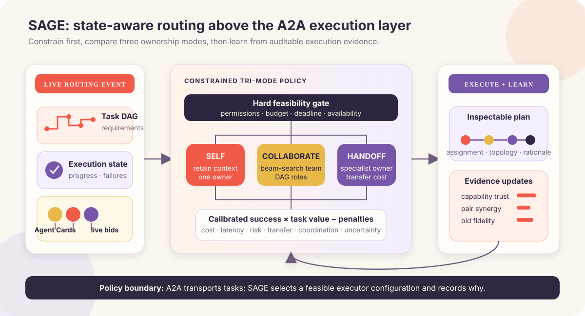
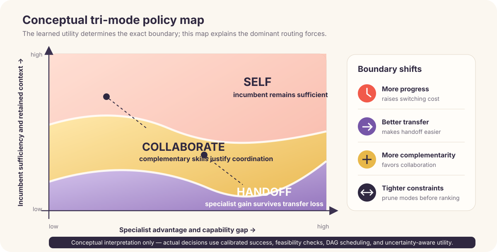
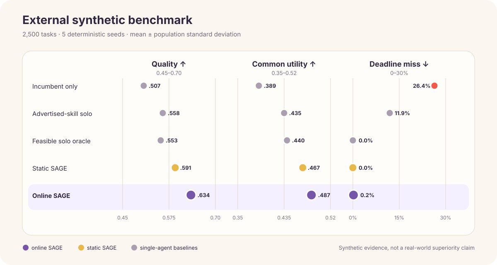

<div align="center">

# Sprix SAGE Router

### State-aware agent matching for open A2A networks

[](https://github.com/wang2122/sprix-sage-router/actions/workflows/tests.yml)
[](https://www.python.org/)
[](LICENSE)
[](#project-status)

**An open-source research output of [Sprix AI](#about-sprix-ai) at 屿智同行.**

Choose whether an agent should **continue alone**, **recruit complementary collaborators**, or **hand off the task**—then assign task-DAG roles, schedule dependencies, and learn from execution evidence under permission, budget, and deadline constraints.

[Quick start](#quick-start) · [Algorithm](ALGORITHM.md) · [Benchmark](#benchmark) · [Contributing](CONTRIBUTING.md) · [Security](SECURITY.md)

</div>

---

## Why SAGE?

Agent discovery tells a system which agents exist. It does not answer the harder runtime question: **who should work with whom after execution has already begun?**

SAGE—**State-Aware Graph Exchange**—is the decision layer between A2A discovery and task execution. It evaluates three routes in one auditable objective:

| Route | Ownership | Best used when |
|---|---|---|
| **SELF** | Incumbent agent | Existing capability and accumulated context are sufficient |
| **COLLABORATE** | Incumbent retains ownership | A small complementary team covers missing requirements |
| **HANDOFF** | A peer takes full ownership | Specialist advantage exceeds context-transfer loss |

SAGE is designed to sit above the [Agent2Agent (A2A) protocol](https://a2a-protocol.org/latest/). A2A provides Agent Cards, messages, tasks, artifacts, authentication, and transport. SAGE decides **which feasible agent configuration should execute the task, in which mode, and why**.



<p align="center"><sub><b>Figure 1.</b> SAGE constrains the candidate space before comparing SELF, COLLABORATE, and HANDOFF, then updates contextual trust from execution evidence.</sub></p>

## What makes SAGE different?

- **Mid-execution tri-mode routing.** SELF, COLLABORATE, and HANDOFF compete in the same utility function instead of relying on disconnected heuristics.
- **Progress-aware replanning.** Active executors, completed DAG nodes, failures, accumulated progress, and transferable context affect whether switching is worthwhile.
- **Complementarity before prestige.** A team is rewarded for marginal requirement coverage, not for collecting individually high-ranked but redundant agents.
- **Contextual trust instead of one reputation score.** Reliability is learned per agent and per requirement, so success in coding does not automatically imply strength in research.
- **Task-DAG role assignment.** Every remaining requirement is assigned to an executor; dependency edges become an inspectable communication topology and critical-path latency estimate.
- **Learned outcome model.** A regularized online predictor replaces the original fixed success equation and can later be swapped for a production reward model.
- **Bounded team search.** Beam search compares multiple team prefixes instead of committing to one greedy sequence.
- **Bid fidelity.** Quoted confidence, cost, and latency are calibrated against observed execution evidence.
- **Permission-first matching.** Ineligible agents never enter the ranking, regardless of predicted quality.
- **Evidence-aware credit.** Per-requirement and per-agent outcomes avoid giving every teammate identical full credit.
- **Auditable output.** Every decision includes assignments, topology, success, coverage, cost, latency, risk, utility, and a human-readable rationale.

## Core algorithm

For task requirement \(r\), SAGE combines global and requirement-conditioned trust into calibrated capability \(q_{a,r}\). Team coverage is:

$$
C_r(S)=1-\prod_{a\in S}(1-q_{a,r})
$$

Each requirement is assigned to the strongest calibrated team member. SAGE schedules these assignments over the requirement DAG, serializing work assigned to one agent and parallelizing independent work assigned to different agents. Team-level cost and critical-path latency are checked again after construction.

Every feasible route is ranked by:

$$
U(m,S,z,E)=V\hat p_\theta(y=1\mid x,m,S,z,E)-\lambda_c C-\lambda_l L-\lambda_r R-\lambda_h H-\lambda_o O-\lambda_u\mathcal U+\beta\mathcal B
$$

Here \(z\) is role assignment, \(E\) is the induced communication topology, \(H\) is context-transfer loss, \(O\) is coordination overhead, and \(\mathcal U/\mathcal B\) support uncertainty-aware exploration. The full design and limitations are documented in [ALGORITHM.md](ALGORITHM.md).



<p align="center"><sub><b>Figure 2.</b> Conceptual policy map. Exact boundaries are learned and constraint-dependent; the diagram highlights the dominant forces behind route changes.</sub></p>

## Quick start

The reference implementation requires Python 3.10+ and has no runtime dependencies.

```bash
git clone https://github.com/wang2122/sprix-sage-router.git
cd sprix-sage-router
python demo.py
```

Run the verification suite:

```bash
python -m unittest -v
python benchmark.py
```

Minimal usage:

```python
from sprix_sage import Agent, ExecutionOutcome, Requirement, SAGERouter, Task

agents = [
    Agent("planner", {"planning": 0.92, "coding": 0.55}, cost=0.08, latency_ms=900),
    Agent("coder", {"planning": 0.35, "coding": 0.96}, cost=0.12, latency_ms=1200),
]

task = Task(
    "build-feature",
    requirements=(
        Requirement("planning", 0.4),
        Requirement("coding", 0.6, depends_on=("planning",)),
    ),
    value=1.0,
    budget=0.30,
    deadline_ms=4000,
    progress=0.35,
)

router = SAGERouter(agents, incumbent_id="planner")
decision = router.route(task)
print(decision.mode, decision.assignments, decision.topology)

# Feed back the strongest available evidence after execution.
router.record_outcome(
    decision,
    ExecutionOutcome(
        success=0.9,
        requirement_scores={"planning": 0.95, "coding": 0.86},
        actual_cost=0.19,
        actual_latency_ms=1450,
    ),
)
```

## A2A integration

Production integration maps protocol and marketplace signals into SAGE as follows:

| A2A or marketplace signal | SAGE representation |
|---|---|
| `AgentCard.skills` | Normalized capability vector |
| Security requirements | Hard `permissions` eligibility filter |
| Supported input/output modes | Compatibility filter before scoring |
| Task status, artifacts, and failures | `ExecutionState`, completed DAG nodes, and transfer loss |
| Provider quote | `Bid(cost, latency, confidence)` |
| Completed task evaluation | Contextual trust, pair residual, success model, and bid-fidelity updates |

The current prototype returns a routing decision; it intentionally does not transmit tasks. An A2A client can execute the selected route through `message/send`, streaming, task polling, or cancellation.

## Benchmark

`benchmark.py` runs 2,500 tasks over five deterministic seeds in an external simulator. Hidden capability, pair effects, nonlinear quality, realized cost, and realized latency are deliberately different from SAGE's prediction model. Values are mean ± population standard deviation across seeds:



<p align="center"><sub><b>Figure 3.</b> Paired synthetic comparison under a shared external evaluator. Error bars show population standard deviation across five seeds.</sub></p>

| Strategy | Quality | Common utility | Cost / budget | Deadline miss |
|---|---:|---:|---:|---:|
| Incumbent only | 0.507 ± 0.003 | 0.389 ± 0.002 | 0.239 ± 0.005 | 26.4% |
| Advertised-skill solo | 0.558 ± 0.005 | 0.435 ± 0.005 | 0.292 ± 0.004 | 11.9% |
| Feasible solo oracle | 0.553 ± 0.005 | 0.440 ± 0.005 | 0.271 ± 0.005 | 0.0% |
| Static SAGE | 0.591 ± 0.007 | 0.467 ± 0.007 | 0.329 ± 0.007 | 0.0% |
| **Online SAGE** | **0.634 ± 0.006** | **0.487 ± 0.006** | 0.434 ± 0.011 | 0.2% |

All strategies are evaluated with the same external quality-cost-latency utility. Online SAGE spends more than static SAGE to obtain higher simulated quality; that trade-off remains visible instead of being hidden behind a capability-only score.

> [!IMPORTANT]
> These synthetic numbers test learning and constraints without using SAGE's own score as ground truth. They are still **not** evidence of real-world superiority. A publishable evaluation requires confidence intervals over real executions, strong learned-routing baselines, heterogeneous agent benchmarks, marketplace trace replay, calibration analysis, and adversarial conditions.

## Repository map

| Path | Purpose |
|---|---|
| `sprix_sage.py` | Contextual router, DAG scheduler, beam search, and online updates |
| `ALGORITHM.md` | Formal objective, search, credit assignment, and limitations |
| `demo.py` | Readable end-to-end routing example |
| `benchmark.py` | External nonlinear simulator and common-utility baselines |
| `test_sprix_sage.py` | Behavioral unit tests |
| `.github/workflows/tests.yml` | Multi-version continuous integration |

## Roadmap

- [ ] Signed Agent Card ingestion and capability normalization
- [x] Requirement-conditioned trust and online success prediction
- [x] Requirement DAG assignment and team-level deadline checks
- [x] Evidence-aware partial credit and quote-fidelity learning
- [ ] Learned task-text embeddings and candidate retrieval
- [ ] Real A2A adapters for discovery, execution, streaming, and cancellation
- [ ] Offline replay on anonymized Sprix marketplace traces
- [ ] Adversarial-bid, churn, privacy, and policy-violation evaluation
- [ ] Distributed router service with observability and human approval gates

## Research foundations

- [Agent2Agent Protocol Specification](https://github.com/a2aproject/A2A/blob/main/docs/specification.md) — interoperable Agent Cards and stateful tasks.
- [RouteLLM: Learning to Route LLMs with Preference Data](https://arxiv.org/abs/2406.18665), ICLR 2025 — preference-based cost-quality routing.
- [A Dynamic LLM-Powered Agent Network for Task-Oriented Agent Collaboration](https://openreview.net/pdf?id=XII0Wp1XA9), COLM 2024 — task-specific dynamic team selection.
- [GPTSwarm: Language Agents as Optimizable Graphs](https://arxiv.org/abs/2402.16823), ICML 2024 — agent systems as optimizable computation graphs.
- [AFlow: Automating Agentic Workflow Generation](https://openreview.net/attachment?id=z5uVAKwmjf&name=pdf), ICLR 2025 — automated workflow search and optimization.
- [MasRouter: Learning to Route LLMs for Multi-Agent Systems](https://arxiv.org/abs/2502.11133), 2025 preprint — collaboration mode, role, and model routing.

## Project status

SAGE is an **early-stage research preview**, not a production SLA or a peer-reviewed result. Version 0.2 adds a genuinely learned but deliberately lightweight policy layer; it is not a substitute for real trace training or causal off-policy evaluation. Production deployment requires calibrated evaluators, authenticated identities, signed capability metadata, privacy and security review, persistent event-driven recovery, monitoring, and task-specific validation.

## About Sprix AI

Sprix AI is the A2A initiative of **屿智同行**, focused on agent discovery, task matching, multi-agent scheduling, and transaction mechanisms for dependable agent-to-agent service exchange. Sprix SAGE Router is an open-source algorithmic research output of that initiative.

Company attribution describes the project's origin; this public repository remains a research preview and does not expose proprietary production systems or data.

## Team & project leadership

- **Yonghao Zhang** — CEO of 屿智同行; Master's degree in Computer Science from Tsinghua University.
- **Yichen Wang** — CTO of 屿智同行; Sprix AI project lead and SAGE algorithm designer.

Additional community contributions are credited through their commits, pull requests, and the repository's [contributors graph](https://github.com/wang2122/sprix-sage-router/graphs/contributors).

## Community and governance

We welcome technically grounded issues and pull requests. Please read [CONTRIBUTING.md](CONTRIBUTING.md), follow the [Code of Conduct](CODE_OF_CONDUCT.md), and report vulnerabilities according to [SECURITY.md](SECURITY.md).

If you use this design in academic work, cite the repository metadata in [CITATION.cff](CITATION.cff).

## License

Released under the [MIT License](LICENSE). Copyright © 2026 Sprix AI at 屿智同行.
