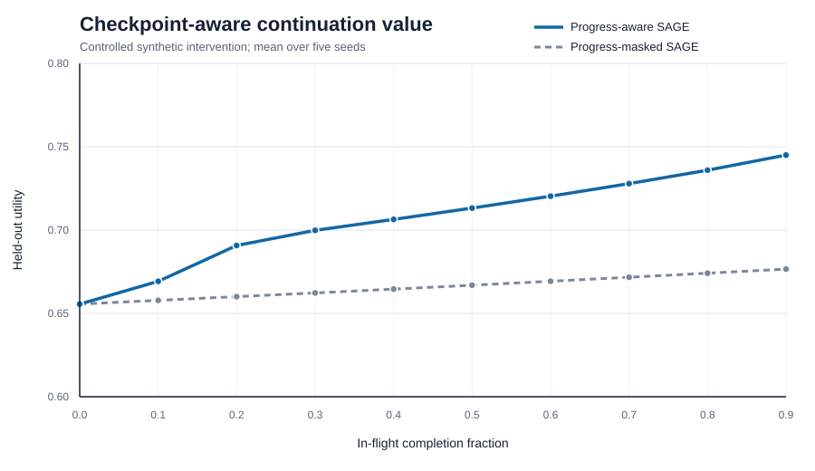

<div align="center">

# Sprix SAGE Router

### Checkpoint-aware mid-execution rerouting for open A2A networks

[](https://github.com/wang2122/sprix-sage-router/actions/workflows/tests.yml)
[](https://www.python.org/)
[](LICENSE)
[](#project-status)

**An open-source research output of [Sprix AI](#about-sprix-ai) at 屿智同行.**

Choose whether an in-flight task should **continue**, **recruit collaborators**, or **hand off** after accounting for completed DAG nodes, reusable artifacts, observed partial quality, remaining work, failures, budget, and deadline.

[Quick start](#quick-start) · [Algorithm](ALGORITHM.md) · [Related work](RELATED_WORK.md) · [A2A integration](docs/INTEGRATION.md) · [Operations](docs/OPERATIONS.md) · [Benchmark](#benchmark) · [Changelog](CHANGELOG.md) · [Contributing](CONTRIBUTING.md)

</div>

---

## Why SAGE?

Agent discovery tells a system which agents exist. It does not answer the harder runtime question: **who should work with whom after execution has already begun?**

SAGE—**State-Aware Graph Exchange**—is the decision layer between A2A discovery and task execution. It evaluates three routes in one auditable objective:

| Route | Ownership | Best used when |
|---|---|---|
| **SELF** | Incumbent agent | Existing capability and accumulated context are sufficient |
| **COLLABORATE** | Incumbent retains ownership | A small complementary team covers missing requirements |
| **HANDOFF** | A peer takes full ownership | Specialist advantage exceeds context-transfer loss |

SAGE is designed to sit above the [Agent2Agent (A2A) protocol](https://a2a-protocol.org/latest/). A2A provides Agent Cards, messages, tasks, artifacts, authentication, and transport. SAGE decides **which feasible agent configuration should execute the task, in which mode, and why**.


<p align="center"><sub><b>Figure 1.</b> SAGE filters candidates, compares all three routing modes, jointly searches assignments and schedules, ranks feasible plans, and learns from execution evidence.</sub></p>

## Research focus

SAGE is deliberately narrow: **checkpoint-aware reconfiguration after execution has begun**.

- **Concrete continuation value.** The router preserves completed requirements and combines in-flight completion, observed partial quality, current ownership, and artifact portability to estimate how much work each candidate must actually redo.
- **Comparable runtime actions.** SELF, COLLABORATE, and HANDOFF share one permission-, budget-, and deadline-constrained action space. Progress-masked and static-coalition baselines receive the same registry and limits.
- **Requirement-conditioned evidence.** Reliability is tracked per agent and requirement instead of assuming that one reputation score transfers across skills.
- **Trajectory-level falsification.** A separate evaluator replays checkpoints and scores artifact reuse, added cost, recovery latency, wasted work, and final quality without calling SAGE's switching equation.

Noisy-OR, beam search, a linear utility, Beta beliefs, online logistic regression, and DAG-induced communication edges are not claimed as inventions. They are replaceable implementation mechanisms. The repository also provides permission-first filtering, bounded candidate search, workload-sensitive quotes, auditable alternatives, degraded-route flags, state persistence, and transport-neutral A2A plans as engineering features.

## Core algorithm

For task requirement \(r\), SAGE combines global and requirement-conditioned trust into calibrated capability \(q_{a,r}\). If the current owner has completed fraction \(f_r\), a candidate owner reuses fraction \(\eta_r\):

$$
\eta_r=\begin{cases}f_r,&\text{owner retained}\\f_r\tau_r,&\text{owner changed}\end{cases},\qquad
\bar q_{a,r}=\eta_r q^{\mathrm{current}}_r+(1-\eta_r)q_{a,r}
$$

Here \(\tau_r\) is artifact portability. Only the assigned owner contributes requirement coverage; adding an unassigned teammate no longer creates a noisy-OR quality gain. The same reused fraction reduces projected remaining cost and duration, so lost work is not charged again inside the learned success probability.

SAGE jointly searches calibrated requirement owners and their schedule. Work assigned to one agent is serialized, work on independent agents can run concurrently, and team-level cost and critical-path latency are checked again after construction.

Every feasible route is ranked by:

$$
U(m,S,z,E)=V\hat p_\theta(y=1\mid x,m,S,z,E)-\lambda_c C-\lambda_l L-\lambda_r R-\lambda_h H-\lambda_o O-\lambda_u\mathcal U+\beta\mathcal B
$$

Here \(z\) is role assignment, \(E\) is the induced communication topology, \(H\) is context-transfer loss, \(O\) is coordination overhead, and \(\mathcal U/\mathcal B\) support uncertainty-aware exploration. The full design and limitations are documented in [ALGORITHM.md](ALGORITHM.md).

## Quick start

The reference implementation requires Python 3.10+ and has no runtime dependencies.

```bash
git clone https://github.com/wang2122/sprix-sage-router.git
cd sprix-sage-router
python demo.py
```

Run the verification suite:

```bash
python -m unittest -v
python benchmark.py
python benchmark_dynamic.py
python benchmark_trust.py
```

Minimal usage:

```python
from sprix_sage import (
    Agent,
    ExecutionOutcome,
    ExecutionState,
    Requirement,
    SAGERouter,
    Task,
)

agents = [
    Agent("planner", {"planning": 0.92, "coding": 0.55}, cost=0.08, latency_ms=900),
    Agent("coder", {"planning": 0.35, "coding": 0.96}, cost=0.12, latency_ms=1200),
]

task = Task(
    "build-feature",
    requirements=(
        Requirement("planning", 0.4),
        Requirement("coding", 0.6, depends_on=("planning",)),
    ),
    value=1.0,
    budget=0.30,
    deadline_ms=4000,
    progress=0.35,
)

router = SAGERouter(agents, incumbent_id="planner")
state = ExecutionState(
    active_agents=("planner",),
    active_assignments={"planning": "planner", "coding": "planner"},
    completed_requirements=frozenset({"planning"}),
    inflight_requirement="coding",
    inflight_progress=0.35,
    inflight_quality=0.72,
    artifact_transferability={"planning": 0.95, "coding": 0.40},
)
trace = router.route_with_trace(task, state=state)
decision = trace.selected
print(decision.mode, decision.assignments, decision.topology)
print(trace.excluded_agents)

# Feed back the strongest available evidence after execution.
router.record_outcome(
    decision,
    ExecutionOutcome(
        success=0.9,
        requirement_scores={"planning": 0.95, "coding": 0.86},
        actual_cost=0.19,
        actual_latency_ms=1450,
    ),
)

# Persist learned evidence after validated outcomes.
snapshot = router.export_state()
```

## A2A integration

Production integration maps protocol and marketplace signals into SAGE as follows:

| A2A or marketplace signal | SAGE representation |
|---|---|
| `AgentCard.skills` | Normalized capability vector |
| Security requirements | Hard `permissions` eligibility filter |
| Supported input/output modes | Compatibility filter before scoring |
| Task status, artifacts, and failures | `ExecutionState`, active ownership, completed nodes, in-flight quality/progress, and per-artifact portability |
| Provider quote | `Bid(cost, latency, confidence)` |
| Completed task evaluation | Contextual trust, explicit pair evidence, success model, and bid-fidelity updates |

`sprix_a2a.py` validates declared skill IDs against locally calibrated evidence and converts the selected route into a transport-neutral `ExecutionPlan`. The plan includes ownership, assignments, DAG dependencies, communication edges, estimated resources, and rationale.

The current prototype intentionally does not transmit tasks, authenticate endpoints, or verify signatures. An A2A client remains responsible for `message/send`, streaming, polling, cancellation, and secure artifact handling. See the [integration guide](docs/INTEGRATION.md) and runnable [`examples`](examples/README.md).

## Benchmark

The repository separates three questions instead of treating one synthetic table as proof of the whole system.

### Mid-execution trajectory replay

`benchmark_dynamic.py` replays 1,000 checkpoints over five seeds. The independent evaluator scores concrete artifact portability and remaining work; it never calls the router's switch-loss code. Every policy receives the same registry, action space, budget, and deadline.

| Strategy | Utility | Added cost / budget | Recovery latency / deadline | Wasted work | Switch rate | Deadline miss |
|---|---:|---:|---:|---:|---:|---:|
| **Progress-aware SAGE** | **0.298 ± 0.021** | **0.191 ± 0.006** | 0.425 ± 0.015 | **0.059 ± 0.004** | 58.4% | **23.3%** |
| Progress-masked SAGE | 0.291 ± 0.021 | 0.204 ± 0.005 | 0.434 ± 0.018 | 0.104 ± 0.010 | 80.1% | 23.6% |
| Always continue | 0.085 ± 0.025 | 0.159 ± 0.005 | 0.627 ± 0.036 | 0.017 ± 0.003 | 0.0% | 34.4% |
| Always hand off | 0.290 ± 0.017 | 0.237 ± 0.008 | 0.508 ± 0.034 | 0.130 ± 0.010 | 100.0% | 30.5% |
| Static greedy team | 0.239 ± 0.031 | 0.248 ± 0.009 | 0.541 ± 0.035 | 0.080 ± 0.007 | 63.4% | 27.7% |
| Static coalition enumeration | 0.286 ± 0.026 | 0.265 ± 0.005 | 0.487 ± 0.034 | 0.104 ± 0.004 | 94.0% | 27.4% |
| Hidden-state dynamic oracle | 0.375 ± 0.019 | 0.243 ± 0.010 | **0.409 ± 0.014** | 0.085 ± 0.005 | 90.0% | 19.6% |

The controlled intervention holds task, agents, difficulty, artifact portability, budget, and deadline fixed while changing only in-flight completion from 0.0 to 0.9. Progress-aware minus progress-masked utility grows from `0.0000` to `+0.0684`; the complete ten-point curve is emitted in JSON.



<p align="center"><sub><b>Controlled intervention.</b> The two policies are identical except that the masked policy receives zero in-flight completion. Values are synthetic five-seed means, not real-endpoint evidence.</sub></p>

### Requirement-conditioned trust

`benchmark_trust.py` gives per-requirement and single-reputation models the same exogenous round-robin evidence stream, so exploration spend cannot explain the difference. After 500 observations per seed in the heterogeneous specialist setting, per-requirement trust reaches Brier `0.0125 ± 0.0018` and selection regret `0.0094 ± 0.0008`, versus `0.0355 ± 0.0008` and `0.0310 ± 0.0359` for one reputation score. In the homogeneous negative control both methods have zero routing regret, so the benchmark does not manufacture an advantage when specialization is absent.

### Independent-task regression suite

`benchmark.py` still runs 2,500 independent tasks against the structurally separate geometric evaluator. Its purpose is regression and learning ablation, not the mid-execution claim:

| Strategy | Quality | Common utility | Cost / budget | Deadline miss |
|---|---:|---:|---:|---:|
| Incumbent only | 0.332 ± 0.009 | 0.134 ± 0.008 | 0.245 ± 0.005 | 38.0% |
| Advertised-skill solo | 0.445 ± 0.009 | 0.242 ± 0.009 | 0.302 ± 0.004 | 31.1% |
| Hidden feasible solo oracle | 0.473 ± 0.007 | 0.316 ± 0.008 | 0.280 ± 0.004 | 21.8% |
| Random team | 0.301 ± 0.006 | 0.103 ± 0.008 | 0.334 ± 0.010 | 32.3% |
| Greedy team | 0.577 ± 0.007 | 0.387 ± 0.009 | 0.435 ± 0.011 | 23.8% |
| Static SAGE | 0.491 ± 0.005 | 0.334 ± 0.008 | 0.327 ± 0.009 | 23.6% |
| **Learned SAGE, no exploration** | **0.613 ± 0.005** | **0.433 ± 0.008** | 0.428 ± 0.011 | 21.7% |
| Learned SAGE, exploration | 0.606 ± 0.005 | 0.427 ± 0.007 | 0.422 ± 0.012 | 21.3% |
| Learned SAGE, random prior | 0.447 ± 0.052 | 0.308 ± 0.049 | **0.297 ± 0.034** | **15.2%** |

All three CLIs support deterministic seeds and JSON output. Exact commands, schemas, curves, and limitations are in the [benchmarking guide](docs/BENCHMARKING.md).

> [!IMPORTANT]
> These synthetic numbers are regression and falsification evidence only. Both evaluators are authored with the project and are **not** evidence of real-world superiority. A publishable evaluation still requires repeated checkpointed executions on heterogeneous real endpoints and an independently governed artifact judge.

## Repository map

| Path | Purpose |
|---|---|
| `sprix_sage.py` | Contextual router, DAG scheduler, beam search, audit traces, and persistent online state |
| `sprix_learning.py` | Configurable online model and Beta beliefs |
| `sprix_types.py` | Validated tasks, agents, bids, outcomes, decisions, and traces |
| `sprix_a2a.py` | Safe Agent Card normalization and transport-neutral execution plans |
| `ALGORITHM.md` | Formal objective, search, credit assignment, and limitations |
| `demo.py` | Readable end-to-end routing example |
| `examples/` | A2A planning, failure recovery, and persistence examples |
| `docs/` | Integration, operations, benchmarking, and research figures |
| `benchmark.py` | Baselines, learning ablations, console output, and JSON reports |
| `benchmark_evaluator.py` | Structurally held-out synthetic quality and resource model |
| `benchmark_dynamic.py` | Controlled progress intervention and checkpoint trajectory replay |
| `benchmark_dynamic_evaluator.py` | Artifact- and remaining-work-based recovery evaluator |
| `benchmark_trust.py` | Per-requirement versus single-reputation convergence study |
| `benchmark_scaling.py` | Candidate-scaling and routing-latency measurement |
| `test_*.py` | Router, adapter, persistence, and benchmark tests |
| `.github/workflows/tests.yml` | Multi-version continuous integration |

## Roadmap

- [ ] Signed Agent Card ingestion and capability normalization
- [x] Requirement-conditioned trust and online success prediction
- [x] Requirement DAG assignment and team-level deadline checks
- [x] Evidence-aware partial credit and quote-fidelity learning
- [x] Auditable alternatives and hard-filter explanations
- [x] Versioned JSON learning-state snapshots
- [x] Transport-neutral Agent Card mapping and execution plans
- [x] Machine-readable deterministic benchmark reports
- [ ] Learned task-text embeddings and candidate retrieval
- [x] Bounded quote-only candidate prefilter and request-local scoring cache
- [x] Checkpoint-aware remaining-work and artifact-reuse model
- [x] Progress-masked, static-coalition, dynamic-oracle, and trust-convergence studies
- [ ] Repeated checkpointed evaluation on heterogeneous real A2A endpoints
- [ ] Real A2A adapters for discovery, execution, streaming, and cancellation
- [ ] Offline replay on anonymized Sprix marketplace traces
- [ ] Adversarial-bid, churn, privacy, and policy-violation evaluation
- [ ] Distributed router service with observability and human approval gates

## Related work

SAGE builds on coalition formation, multi-agent task allocation, combinatorial allocation, contextual bandits, LLM routing, and dynamic agent-network research. The [source-linked comparison](RELATED_WORK.md) explains what each area establishes, how SAGE differs, and which optimality, mechanism-design, and causal-learning claims this repository does **not** make.

## Project status

SAGE is an **early-stage research preview**, not a production SLA or a peer-reviewed result. Current `main` focuses the research claim on checkpoint-aware mid-execution rerouting and adds controlled progress, trajectory, static-coalition, and trust-convergence studies. These synthetic studies are not substitutes for real trace training or causal off-policy evaluation. Production deployment requires calibrated evaluators, authenticated identities, signed capability metadata, privacy and security review, persistent event-driven recovery, monitoring, and task-specific validation. See the [operations guide](docs/OPERATIONS.md) for rollout gates and metrics.

## About Sprix AI

Sprix AI is the A2A initiative of **屿智同行**, focused on agent discovery, task matching, multi-agent scheduling, and transaction mechanisms for dependable agent-to-agent service exchange. Sprix SAGE Router is an open-source algorithmic research output of that initiative.

Company attribution describes the project's origin; this public repository remains a research preview and does not expose proprietary production systems or data.

## Team & project leadership

- **Yonghao Zhang** — CEO of 屿智同行; Master's degree in Computer Science from Tsinghua University.
- **Yichen Wang** — CTO of 屿智同行; Sprix AI project lead and SAGE algorithm designer.

Additional community contributions are credited through their commits, pull requests, and the repository's [contributors graph](https://github.com/wang2122/sprix-sage-router/graphs/contributors).

## Community and governance

We welcome technically grounded issues and pull requests. Please read [CONTRIBUTING.md](CONTRIBUTING.md), follow the [Code of Conduct](CODE_OF_CONDUCT.md), and report vulnerabilities according to [SECURITY.md](SECURITY.md).

If you use this design in academic work, cite the repository metadata in [CITATION.cff](CITATION.cff).

## License

Released under the [MIT License](LICENSE). Copyright © 2026 Sprix AI at 屿智同行.
