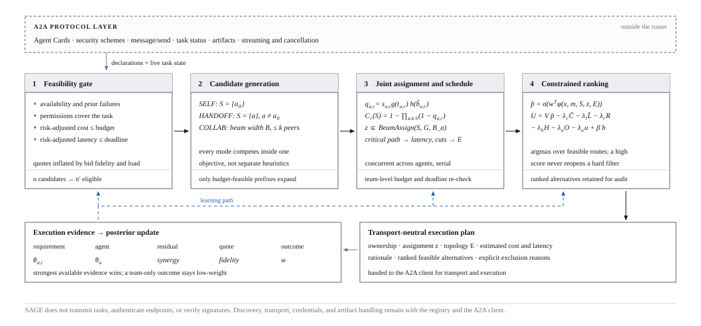

<div align="center">

# Sprix SAGE Router

### State-aware agent matching for open A2A networks

[](https://github.com/wang2122/sprix-sage-router/actions/workflows/tests.yml)
[](https://www.python.org/)
[](LICENSE)
[](#project-status)

**An open-source research output of [Sprix AI](#about-sprix-ai) at 屿智同行.**

Choose whether an agent should **continue alone**, **recruit complementary collaborators**, or **hand off the task**—then assign task-DAG roles, schedule dependencies, and learn from execution evidence under permission, budget, and deadline constraints.

[Quick start](#quick-start) · [Algorithm](ALGORITHM.md) · [Related work](RELATED_WORK.md) · [A2A integration](docs/INTEGRATION.md) · [Operations](docs/OPERATIONS.md) · [Benchmark](#benchmark) · [Changelog](CHANGELOG.md) · [Contributing](CONTRIBUTING.md)

</div>

---

## Why SAGE?

Agent discovery tells a system which agents exist. It does not answer the harder runtime question: **who should work with whom after execution has already begun?**

SAGE—**State-Aware Graph Exchange**—is the decision layer between A2A discovery and task execution. It evaluates three routes in one auditable objective:

| Route | Ownership | Best used when |
|---|---|---|
| **SELF** | Incumbent agent | Existing capability and accumulated context are sufficient |
| **COLLABORATE** | Incumbent retains ownership | A small complementary team covers missing requirements |
| **HANDOFF** | A peer takes full ownership | Specialist advantage exceeds context-transfer loss |

SAGE is designed to sit above the [Agent2Agent (A2A) protocol](https://a2a-protocol.org/latest/). A2A provides Agent Cards, messages, tasks, artifacts, authentication, and transport. SAGE decides **which feasible agent configuration should execute the task, in which mode, and why**.



<p align="center"><sub><b>Figure 1.</b> SAGE filters candidates, compares all three routing modes, jointly searches assignments and schedules, ranks feasible plans, and learns from execution evidence.</sub></p>

## What makes SAGE different?

- **Mid-execution tri-mode routing.** SELF, COLLABORATE, and HANDOFF compete in the same utility function instead of relying on disconnected heuristics.
- **Progress-aware replanning.** Active executors, completed DAG nodes, failures, accumulated progress, and transferable context affect whether switching is worthwhile.
- **Complementarity before prestige.** A team is rewarded for marginal requirement coverage, not for collecting individually high-ranked but redundant agents.
- **Contextual trust instead of one reputation score.** Reliability is learned per agent and per requirement, so success in coding does not automatically imply strength in research.
- **Task-DAG role assignment.** Every remaining requirement is assigned to an executor; dependency edges become an inspectable communication topology and critical-path latency estimate.
- **Joint team and role search.** A nested assignment beam can trade a small capability margin for parallel execution instead of rejecting a deadline-feasible team after greedy role assignment.
- **Learned outcome model.** A regularized online predictor replaces the original fixed success equation and can later be swapped for a production reward model.
- **Bounded team search.** Beam search compares multiple team prefixes instead of committing to one greedy sequence.
- **Bounded candidate prefilter.** A deterministic top-k relevance pass and request-local caches keep combinatorial search from scaling with the full registry.
- **Bid fidelity.** Quoted confidence, cost, and latency are calibrated against observed execution evidence.
- **Workload-sensitive cost.** Quotes combine a small activation fee with the weight of requirements actually assigned to each agent.
- **Permission-first matching.** Ineligible agents never enter the ranking, regardless of predicted quality.
- **Evidence-aware credit.** Per-requirement and per-agent outcomes avoid giving every teammate identical full credit.
- **Auditable alternatives.** `route_with_trace` records the winner, ranked feasible alternatives, eligible agents, and explicit hard-filter reasons.
- **Persistent learning.** Versioned JSON snapshots preserve contextual trust, synergy, bid fidelity, and online-model state across restarts.
- **Auditable degradation.** If budget or deadline feasibility is impossible, the router can return a least-violating authorized plan with explicit flags instead of crashing.
- **Transport-neutral A2A plans.** Agent Card helpers combine declarations with local evidence and produce execution plans without hiding transport responsibilities.

## Core algorithm

For task requirement \(r\), SAGE combines global and requirement-conditioned trust into calibrated capability \(q_{a,r}\). Team coverage is:

$$
C_r(S)=1-\prod_{a\in S}(1-q_{a,r})
$$

SAGE jointly searches calibrated requirement owners and their schedule. It can retain a slightly weaker executor when that choice parallelizes independent DAG nodes and improves constrained utility. Work assigned to one agent is serialized, work on independent agents can run concurrently, and team-level cost and critical-path latency are checked again after construction.

Every feasible route is ranked by:

$$
U(m,S,z,E)=V\hat p_\theta(y=1\mid x,m,S,z,E)-\lambda_c C-\lambda_l L-\lambda_r R-\lambda_h H-\lambda_o O-\lambda_u\mathcal U+\beta\mathcal B
$$

Here \(z\) is role assignment, \(E\) is the induced communication topology, \(H\) is context-transfer loss, \(O\) is coordination overhead, and \(\mathcal U/\mathcal B\) support uncertainty-aware exploration. The full design and limitations are documented in [ALGORITHM.md](ALGORITHM.md).

## Quick start

The reference implementation requires Python 3.10+ and has no runtime dependencies.

```bash
git clone https://github.com/wang2122/sprix-sage-router.git
cd sprix-sage-router
python demo.py
```

Run the verification suite:

```bash
python -m unittest -v
python benchmark.py
```

Minimal usage:

```python
from sprix_sage import Agent, ExecutionOutcome, Requirement, SAGERouter, Task

agents = [
    Agent("planner", {"planning": 0.92, "coding": 0.55}, cost=0.08, latency_ms=900),
    Agent("coder", {"planning": 0.35, "coding": 0.96}, cost=0.12, latency_ms=1200),
]

task = Task(
    "build-feature",
    requirements=(
        Requirement("planning", 0.4),
        Requirement("coding", 0.6, depends_on=("planning",)),
    ),
    value=1.0,
    budget=0.30,
    deadline_ms=4000,
    progress=0.35,
)

router = SAGERouter(agents, incumbent_id="planner")
trace = router.route_with_trace(task)
decision = trace.selected
print(decision.mode, decision.assignments, decision.topology)
print(trace.excluded_agents)

# Feed back the strongest available evidence after execution.
router.record_outcome(
    decision,
    ExecutionOutcome(
        success=0.9,
        requirement_scores={"planning": 0.95, "coding": 0.86},
        actual_cost=0.19,
        actual_latency_ms=1450,
    ),
)

# Persist learned evidence after validated outcomes.
snapshot = router.export_state()
```

## A2A integration

Production integration maps protocol and marketplace signals into SAGE as follows:

| A2A or marketplace signal | SAGE representation |
|---|---|
| `AgentCard.skills` | Normalized capability vector |
| Security requirements | Hard `permissions` eligibility filter |
| Supported input/output modes | Compatibility filter before scoring |
| Task status, artifacts, and failures | `ExecutionState`, completed DAG nodes, and transfer loss |
| Provider quote | `Bid(cost, latency, confidence)` |
| Completed task evaluation | Contextual trust, explicit pair evidence, success model, and bid-fidelity updates |

`sprix_a2a.py` validates declared skill IDs against locally calibrated evidence and converts the selected route into a transport-neutral `ExecutionPlan`. The plan includes ownership, assignments, DAG dependencies, communication edges, estimated resources, and rationale.

The current prototype intentionally does not transmit tasks, authenticate endpoints, or verify signatures. An A2A client remains responsible for `message/send`, streaming, polling, cancellation, and secure artifact handling. See the [integration guide](docs/INTEGRATION.md) and runnable [`examples`](examples/README.md).

## Benchmark

`benchmark.py` runs 2,500 tasks over five deterministic seeds against the separate `benchmark_evaluator.py`. Latent skills are independently specified, quality is geometric/bottleneck-based, compatibility is multiplicative, and realized resources use equations different from SAGE. Random and greedy team baselines ensure SAGE is not the only policy allowed to collaborate. Values are mean ± population standard deviation across seeds:

| Strategy | Quality | Common utility | Cost / budget | Deadline miss |
|---|---:|---:|---:|---:|
| Incumbent only | 0.332 ± 0.009 | 0.134 ± 0.008 | 0.245 ± 0.005 | 38.0% |
| Advertised-skill solo | 0.445 ± 0.009 | 0.242 ± 0.009 | 0.302 ± 0.004 | 31.1% |
| Hidden feasible solo oracle | 0.473 ± 0.007 | 0.316 ± 0.008 | 0.280 ± 0.004 | 21.8% |
| Random team | 0.307 ± 0.007 | 0.111 ± 0.011 | 0.331 ± 0.012 | 32.2% |
| Greedy team | 0.577 ± 0.007 | 0.387 ± 0.009 | 0.435 ± 0.011 | 23.8% |
| Static SAGE | 0.518 ± 0.012 | 0.363 ± 0.013 | 0.394 ± 0.011 | **13.9%** |
| **Learned SAGE, no exploration** | **0.627 ± 0.006** | **0.447 ± 0.010** | 0.441 ± 0.014 | 20.0% |
| Learned SAGE, exploration | 0.622 ± 0.006 | 0.444 ± 0.009 | 0.437 ± 0.011 | 19.8% |
| Learned SAGE, random prior | 0.430 ± 0.045 | 0.291 ± 0.041 | 0.288 ± 0.029 | 16.0% |

Greedy team and learned SAGE spend nearly the same normalized budget (0.435 versus 0.441), while learned SAGE has higher held-out quality and utility in this simulator. Static SAGE has fewer deadline misses. Learning/no-learning, exploration/no-exploration, random-prior, and first/last-100-task ablations are reported in the [benchmarking guide](docs/BENCHMARKING.md).

Use `python benchmark.py --json benchmark-results.json` for a versioned machine-readable summary, or change seeds and suite size with `--seeds` and `--tasks-per-seed`. See the [benchmarking guide](docs/BENCHMARKING.md).

> [!IMPORTANT]
> These synthetic numbers are regression and falsification evidence only. The evaluator is still authored with the project and is **not** evidence of real-world superiority. A publishable evaluation requires repeated real executions, stronger learned and optimization baselines, heterogeneous endpoints, trace replay, calibration analysis, and adversarial conditions.

## Repository map

| Path | Purpose |
|---|---|
| `sprix_sage.py` | Contextual router, DAG scheduler, beam search, audit traces, and persistent online state |
| `sprix_learning.py` | Configurable online model and Beta beliefs |
| `sprix_types.py` | Validated tasks, agents, bids, outcomes, decisions, and traces |
| `sprix_a2a.py` | Safe Agent Card normalization and transport-neutral execution plans |
| `ALGORITHM.md` | Formal objective, search, credit assignment, and limitations |
| `demo.py` | Readable end-to-end routing example |
| `examples/` | A2A planning, failure recovery, and persistence examples |
| `docs/` | Integration, operations, benchmarking, and research figures |
| `benchmark.py` | Baselines, learning ablations, console output, and JSON reports |
| `benchmark_evaluator.py` | Structurally held-out synthetic quality and resource model |
| `benchmark_scaling.py` | Candidate-scaling and routing-latency measurement |
| `test_*.py` | Router, adapter, persistence, and benchmark tests |
| `.github/workflows/tests.yml` | Multi-version continuous integration |

## Roadmap

- [ ] Signed Agent Card ingestion and capability normalization
- [x] Requirement-conditioned trust and online success prediction
- [x] Requirement DAG assignment and team-level deadline checks
- [x] Evidence-aware partial credit and quote-fidelity learning
- [x] Auditable alternatives and hard-filter explanations
- [x] Versioned JSON learning-state snapshots
- [x] Transport-neutral Agent Card mapping and execution plans
- [x] Machine-readable deterministic benchmark reports
- [ ] Learned task-text embeddings and candidate retrieval
- [x] Bounded quote-only candidate prefilter and request-local scoring cache
- [ ] Real A2A adapters for discovery, execution, streaming, and cancellation
- [ ] Offline replay on anonymized Sprix marketplace traces
- [ ] Adversarial-bid, churn, privacy, and policy-violation evaluation
- [ ] Distributed router service with observability and human approval gates

## Related work

SAGE builds on coalition formation, multi-agent task allocation, combinatorial allocation, contextual bandits, LLM routing, and dynamic agent-network research. The [source-linked comparison](RELATED_WORK.md) explains what each area establishes, how SAGE differs, and which optimality, mechanism-design, and causal-learning claims this repository does **not** make.

## Project status

SAGE is an **early-stage research preview**, not a production SLA or a peer-reviewed result. Version 0.3 adds structurally held-out team baselines and learning ablations, bounded candidate search, workload-sensitive pricing, explicit degraded-route flags, and evidence-gated pair learning. These are not substitutes for real trace training or causal off-policy evaluation. Production deployment requires calibrated evaluators, authenticated identities, signed capability metadata, privacy and security review, persistent event-driven recovery, monitoring, and task-specific validation. See the [operations guide](docs/OPERATIONS.md) for rollout gates and metrics.

## About Sprix AI

Sprix AI is the A2A initiative of **屿智同行**, focused on agent discovery, task matching, multi-agent scheduling, and transaction mechanisms for dependable agent-to-agent service exchange. Sprix SAGE Router is an open-source algorithmic research output of that initiative.

Company attribution describes the project's origin; this public repository remains a research preview and does not expose proprietary production systems or data.

## Team & project leadership

- **Yonghao Zhang** — CEO of 屿智同行; Master's degree in Computer Science from Tsinghua University.
- **Yichen Wang** — CTO of 屿智同行; Sprix AI project lead and SAGE algorithm designer.

Additional community contributions are credited through their commits, pull requests, and the repository's [contributors graph](https://github.com/wang2122/sprix-sage-router/graphs/contributors).

## Community and governance

We welcome technically grounded issues and pull requests. Please read [CONTRIBUTING.md](CONTRIBUTING.md), follow the [Code of Conduct](CODE_OF_CONDUCT.md), and report vulnerabilities according to [SECURITY.md](SECURITY.md).

If you use this design in academic work, cite the repository metadata in [CITATION.cff](CITATION.cff).

## License

Released under the [MIT License](LICENSE). Copyright © 2026 Sprix AI at 屿智同行.
