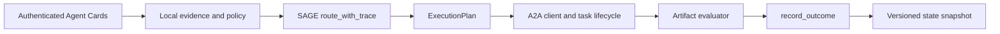

# A2A integration guide

SAGE is a policy layer, not a transport implementation. A production integration should keep discovery, local evidence, routing, execution, and outcome evaluation as separate stages.

## End-to-end flow

1. Discover an Agent Card through an authenticated registry or trusted endpoint.
2. Verify identity, signature, security schemes, supported modes, and policy requirements outside SAGE.
3. Combine declared skill IDs with locally calibrated capability, cost, latency, permission, availability, and load evidence.
4. Call `route_with_trace` to obtain the selected route, feasible alternatives, and excluded-agent reasons.
5. Convert the selected route into an `ExecutionPlan`.
6. Dispatch each plan step through an A2A client while preserving dependency and cancellation semantics.
7. Evaluate the completed artifacts and feed the strongest available evidence to `record_outcome`.
8. Persist the learned state with `export_state`.



## Safe Agent Card normalization

`profile_from_agent_card` only accepts scores for skill IDs actually declared by the card. It deliberately requires the caller to supply numeric capability, cost, and latency evidence instead of deriving trust from marketing text.

```python
from sprix_a2a import profile_from_agent_card

profile = profile_from_agent_card(
    card,
    agent_id="registry:coder-17",
    skill_scores={"coding": 0.91},
    cost=0.08,
    latency_ms=850,
    permissions=frozenset({"repo:read"}),
)
```

The returned `AgentCardProfile` retains card metadata for audit logs and exposes a validated SAGE `Agent` as `profile.agent`.

## Routing trace and execution plan

```python
from sprix_a2a import execution_plan

trace = router.route_with_trace(task, bids, state)
audit_record = trace.to_dict()
plan = execution_plan(task, trace.selected)
transport_payload = plan.to_dict()
```

Bid ingestion is fail-closed: every supplied bid must target the routed task,
reference a registered agent, and be the only bid for that agent. Invalid bid
batches raise `ValueError` instead of being silently ignored or overwritten.

The execution plan contains ownership, executors, requirement assignments, dependency edges, communication edges, workload-sensitive estimated cost and latency, and the routing rationale. It intentionally contains no credentials and performs no network request. Inspect `decision.feasible` and `decision.constraint_violations` before dispatch; degraded plans never relax permissions but may exceed budget or deadline.

Only provide `ExecutionOutcome.pair_scores` when an evaluator measured a pair's
collaboration effect directly. Overall team success and individual scores do not
identify synergy, so the router no longer derives pair credit from them.

## Transport responsibilities

An A2A client built around the plan remains responsible for:

- endpoint authentication and secure transport;
- message and artifact serialization;
- streaming, polling, cancellation, and timeout handling;
- idempotency and retry policy;
- secret isolation and data-loss prevention;
- human approval for high-impact actions;
- evaluating artifacts before recording success.

Do not treat a successful routing decision as a successful task execution.
